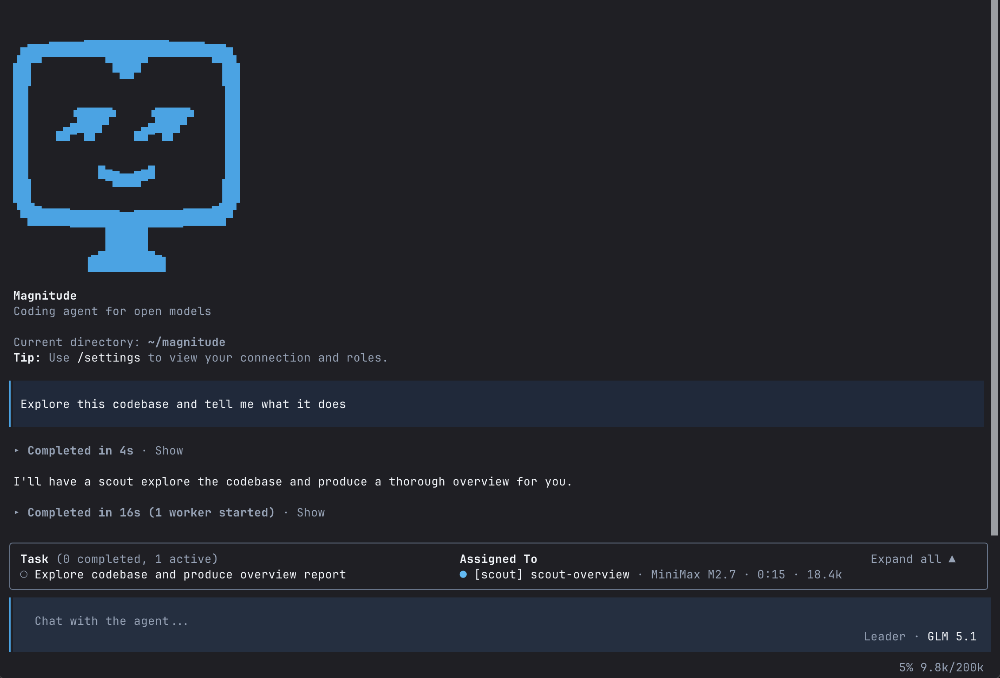

  

      

  <strong>Opinionated coding agent for open models</strong>

Magnitude gets the most out of open models for coding. We continuously test our setup so you don't have to. 

- **Multi-model** - GLM 5.1, Kimi K2.6, DeepSeek V4, all used for the right job
- **Verified providers** - Only the ones serving the models correctly and fast
- **Opinionated** - We continuously test and lean into model capabilities
- **Sustainable** - No wild inference subsidization. Built for what comes next

  

## Get started

1. Run `npm i -g @magnitudedev/cli` in the terminal
2. Run `magnitude` which will ask for an API key
3. Sign up at [app.magnitude.dev](https://app.magnitude.dev) to get your free API key

3 day free trial, no card required. Add a card to continue at $20/month.

> If you are on Windows, you will need to use `wsl`.

## Specialized agents

Magnitude is a curated system of specialized agents, each with its own defined role. These agents are made up of a system prompt, specific context, scoped toolsets, and a dedicated model + reasoning level. Here's the agents we include:

- **Leader.** Talks to the user and delegates work. **Model:** Kimi K2.6.
- **Scout.** Fast and efficient exploration. **Model:** MiniMax M2.7.
- **Architect.** Plans and high-level design thinking. **Model:** Kimi K2.6.
- **Engineer.** Concrete planning and implementation. **Model:** DeepSeek V4 Pro.
- **Critic.** Critical and detail-oriented analysis. **Model:** GLM 5.1.
- **Scientist.** Empirical debugging and information gathering. **Model:** DeepSeek V4 Pro.
- **Artisan.** Tasteful and creative work. **Model:** Kimi K2.6.
- **Advisor.** Smart peer of the leader, always available. **Model:** GLM 5.1.

We test these constantly. New models drop, the lineup updates.

## Why we built this

Open models are good enough for serious coding, but using them well is the wild west. Generalist harnesses like OpenCode and Cline support 30+ providers and 100s of models, which means they can't optimize for any specific setup. You end up hacking your own stack that may or may not work reliably, and needs to be redone every time a new model drops.

Magnitude bundles the harness, models, and provider into one stack we continuously test and optimize. By design, we only support the Magnitude Provider. It's how we really lean into model capabilities and keep the quality bar high. And because of open model economics, we can offer this at $20/month with generous rate limits. Sustainably.

We want to build the coding agent for open models that "just works". One that keeps you at the frontier, without you having to do a thing.

## Acknowledgments

Built on top of [BAML](https://boundaryml.com), [Effect](https://effect.website), and [OpenTUI](https://github.com/anomalyco/opentui).

Inspired by other open source coding agents, including [OpenCode](https://github.com/anomalyco/opencode) and [Codex](https://github.com/openai/codex).
